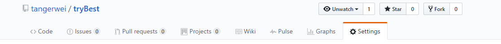
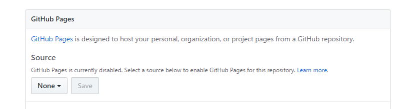
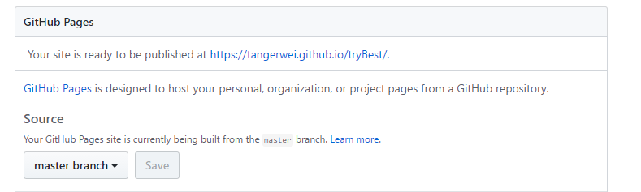

# MyProject
this project is to study tools and test operation these
使用介绍
js文件使用前先进行babel编译，然后再browserify合并文件

2017年3月1日 17:26:06
完成弹窗添加tag的功能 
代码见<strong><a href='./source/scripts/addTag.js'>source/scripts/addTag.js</a></strong>

<a href="https://tangerwei.github.io/MyProject/index.html">demo 目录</a>

文档参考地址  
<strong>react-bootstrap</strong> 
https://react-bootstrap.github.io/components.html 
<strong>Immutability Helpers</strong> 
https://facebook.github.io/react/docs/update.html

<strong>2017年3月2日 10:29:41</strong> 
在source下创建data目录，主存放页面展示过程中的模拟数据

<strong>2017年3月2日 16:30:10</strong> 
添加小模块显示的内容 
代码见<strong><a href='./source/scripts/thumbnails.js'>source/scripts/thumbnails.js</a></strong>

添加小图标显示以及鼠标点击，hover，focus等出现信息提示栏(修改触发OverlayTrigger关键字trigger即可) 
代码见<strong><a href='./source/scripts/glyphInstance.js'>source/scripts/glyphInstance.js</a></strong>

react框架的学习顺序
<ul style="list-style: decimal;">
    <li><a href="https://facebook.github.io/react/docs/update.html">Immutability Helpers</a></li>
    <li><a href="https://facebook.github.io/flux/">Flux</a></li>
    <li><a href="http://www.redux.org.cn/docs/api/index.html">Redux</a></li>
</ul>

<strong>创建新的分支ver2.0.0</strong>

github发布静态网页步骤
<ul style="list-style: decimal;">
    <li>
        
step-1:创建github项目并且clone到本地

    </li>
    <li>step-2:项目目录下创建index.html(必须存在，因为发布时，会自动搜索根目录下的index.html)</li>
    <li>step-3:发布项目，如下图 
    setting目录下
     
    找到GitHub Pages部分
     
    然后在Source的下拉框里选择master branch,然后点击save，就会出现下图 
     
    出现的路径就是你的index页面显示的地址
    </li>
</ul>